# Infra Automation with Terraform

This repository contains the Terraform infrastructure for our project, designed with a strong focus on automation, safety, and module reusability.

## 🏗️ Architecture

The project matches environments (`dev`, `prod`) with reusable `modules`.

## 🧩 Smart Modules

### S3 Lifecycle Protection
We implemented a conditional logic to handle `prevent_destroy`. Since Terraform lifecycle blocks are static, we use a "Split Resource" pattern.

## 🚀 CI/CD Pipelines

We use **GitHub Actions** for an intelligent, dynamic deployment pipeline.

### 1. Dynamic Validation Matrix
The pipeline automatically discovers new modules in the `modules/` directory and validates them in parallel. No YAML edits required when adding modules!

### 2. Deployment Workflow (`terraform-apply.yml`)

### 3. Safe Destroy Workflow (`terraform-destroy.yml`)

A protected workflow to destroy infrastructure.

```mermaid
sequenceDiagram
    participant User
    participant GitHub
    participant Terraform
    
    User->>GitHub: Trigger Destroy
    GitHub->>User: 🛑 "Type DESTROY to confirm"
    
    alt Input is Correct
        User->>GitHub: "DESTROY"
        GitHub->>Terraform: Plan (save to tfplan)
        Terraform->>GitHub: Report Plan
        GitHub->>Terraform: Apply tfplan
        Terraform->>AWS: 🗑️ Delete Resources
    else Input is Wrong
        User->>GitHub: "Pls destroy"
        GitHub->>User: ❌ Error: Exit 1
    end
```

## 🛠️ Getting Started

1.  **Clone**: `git clone <url>`
2.  **Dev**: Edit `envs/dev/main.tf`
3.  **Prod**: Edit `envs/prod/main.tf`
4.  **Push**: Changes trigger the pipeline automatically.

## ⚠️ Troubleshooting

**"Instance cannot be destroyed"**
If you need to destroy a `prod` bucket that has `prevent_destroy = true`:
1.  Go to `modules/s3/main.tf`.
2.  Change `prevent_destroy = true` to `false` in the `protected_bucket` resource.
3.  Run the destroy pipeline.
4.  Revert the change.
