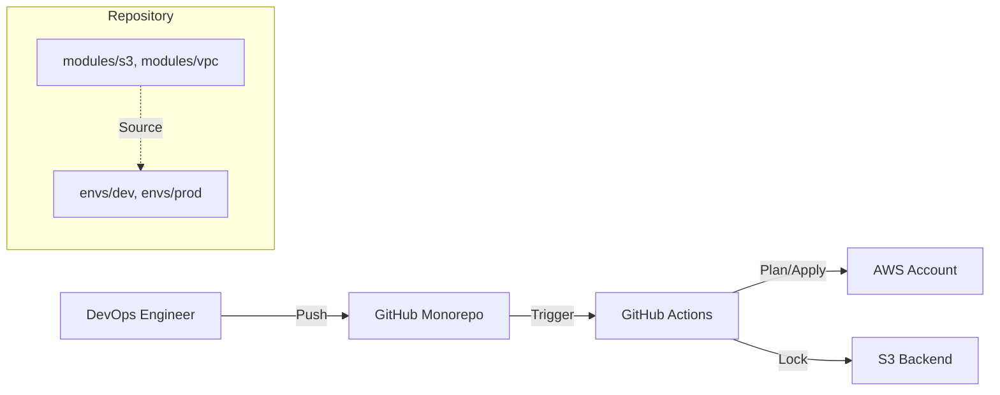
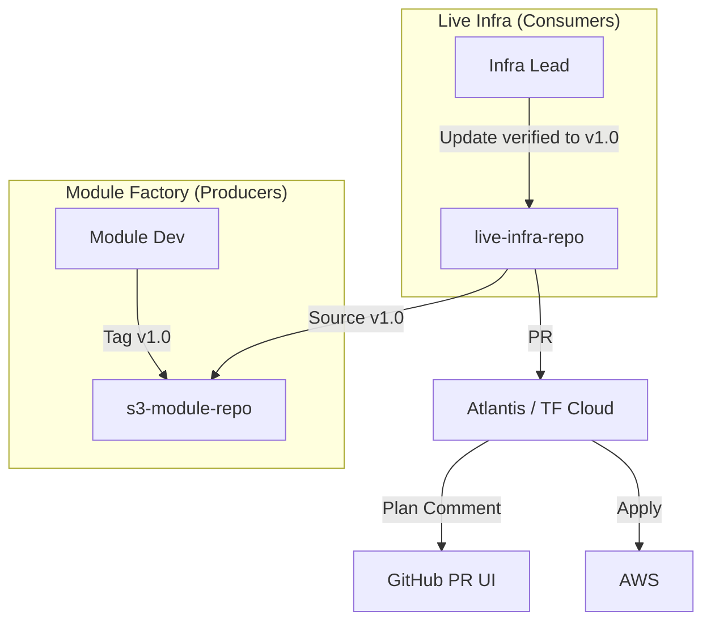
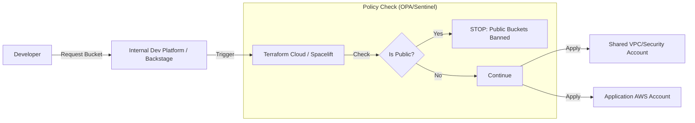

# Terraform in the "Real World": 3 Common Industry Patterns

You asked for an honest assessment: *Is this how big orgs actually do it?*
**Answer**: Yes and No.
- **Yes**: The *structure* (modules vs envs) and the *mechanics* (plan -> apply) are fundamental.
- **No**: Large orgs rarely run `terraform apply` directly inside a GitHub Action shell script on a simple monorepo without extra tooling (like Terragrunt, Atlantis, or Terraform Cloud) to handle scale, state locking, and policy compliance.

Here are the **3 Most Common Scenarios** you will see in the industry, evolving from simple to complex.

---

## Scenario 1: The "Agile Team" (Monorepo)
**Target**: Startups, Small-Medium Businesses, Individual Teams.
**What we built today matches this pattern.**

### Diagram

### Characteristics
- **Structure**: Monorepo. Everything in one place.
- **Versioning**: Implicit. You change a module, it affects everyone immediately (unless you pin git hashes).
- **CI/CD**: Simple "Push to Deploy" or "Release to Deploy".
- **Pros**: Fast, easy to understand, search is easy.
- **Cons**: "Blast Radius" is huge. One bad module change breaks *everything*. CI gets slow as repo grows.

---

## Scenario 2: The "Scale-Up" (Polyrepo + Private Registry)
**Target**: Companies with multiple teams consuming the same infrastructure.

In this model, **Modules** live in their own separate git repositories. They are versioned strictly (v1.0.0, v1.1.0). "Live" infrastructure (dev/prod) lives in a separate repo that *consumes* these modules.

### Diagram

### Key Differences
1.  **Versioning**: You use `source = "git::https://github.com/org/s3-module.git?ref=v1.0.0"`.
2.  **Safety**: Dev environment can use `v1.1.0-beta` while Prod stays on `v1.0.0`.
3.  **CI/CD**: Often uses a "Pull Request Runner" like **Atlantis**. You comment `atlantis plan` on the PR, and a bot runs the plan and comments the output back.

---

## Scenario 3: The "Enterprise" (Hub & Spoke + Policy as Code)
**Target**: Banks, Healthcare, Large Enteprises (1000+ devs).

Here, you don't even run Terraform directly often. You might use a **Self-Service Platform** or very strict GitOps with **Policy as Code** (Sentinel/OPA) to prevent illegal configs before they even become plans.

### Diagram

### Key Differences
- **Governance**: You literally *cannot* deploy a public bucket. The system blocks it.
- **State**: State is stored in a managed service (Terraform Cloud), not just an S3 file.
- **Landing Zones**: Infrastructure is split into "Landing Zones" (Networking, Security, Logging) managed by a central platform team, vs "App Infra" managed by app teams.

---

## Summary Comparison

| Feature | Scenario 1 (Start/Agile) | Scenario 2 (Scale-Up) | Scenario 3 (Enterprise) |
| :--- | :--- | :--- | :--- |
| **Repo** | Monorepo (All-in-one) | Polyrepo (Modules separate) | Many Repos + Platform |
| **Module Source** | Local path `../../modules` | Git URL `git::...ref=v1` | Private Registry |
| **Trigger** | Push / Simple Workflow | Pull Request Comment (Atlantis) | API / Ticket / Drift Detection |
| **State** | S3 + DynamoDB | S3 or Remote Backend | Managed (TFC/Env0) |
| **Best For** | Learning, Small Teams | Teams sharing standards | Compliance & Scale |

### Where is your setup?
You are currently mastering **Scenario 1**. This is the *essential foundation*. You cannot understand Scenario 2 or 3 without mastering the basics of Scenario 1 (State, Modules, Variables, Providers).
